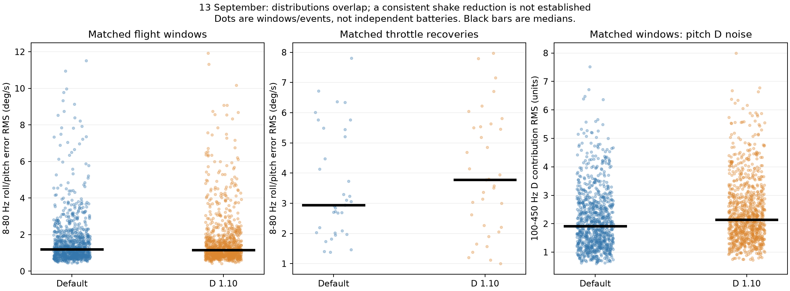

# Betaflight comparison — 13 September 2026

The requested log analysis is complete. The Damping change was applied correctly, but these flights do **not establish a consistent reduction in propwash or faster settling**. The pilot's report of improved feel is useful, and some comparable recoveries are cleaner with Damping 1.10. Others are worse. This is an observational comparison, not proof that either setting is superior.

**Recommendation:** do not increase D beyond 1.10 on the basis of these logs. Retaining 1.10 is a reasonable preference if its feel is clearly better and motor temperatures remain acceptable. If increased heating persists without a repeatable benefit, defaults remain the better-supported baseline. In a follow-up, the pilot reported that motors felt similarly mildly warm with both settings, far from too hot to touch. This is reassuring subjective evidence of no obvious heat penalty in this test, not a measured temperature comparison. Whether crashes damaged or led to replacement of the props remains unknown.

## Files, settings and battery grouping

All seven original files in `../../13_9_2026_bfl` were decoded with the official Blackbox Explorer parser, using the existing local Node adapter. Source BFL files were not modified. There are **1,421,721 valid main samples**, **23 min 22.6 s** of recorded data, and no corrupt, desynchronized or invalid frames reported. Median sample spacing is 987 microseconds (approximately 1.013 kHz); the maximum interval across these logs is 1.064 ms. Two files are brief arm/disarm recordings, leaving five substantial flight segments.

| Likely battery | Files | Substantial recorded duration | Damping |
| --- | --- | --- | --- |
| 1 | LOG00001 + LOG00002 | 4:03.3 + 1:52.8 | 1.00 |
| 2 | LOG00003 + LOG00004 | 5:44.3; LOG00003 is only 0.047 s | 1.00 |
| 3 | LOG00005 + LOG00006 | 5:14.5; LOG00005 is only 1.406 s | 1.10 |
| 4 | LOG00007 | 6:26.2 | 1.10 |

The PID grouping is confirmed by headers. Battery grouping is inferred from the pilot's sequence, chronology, uptime and voltage; the logs contain no battery identifier. LOG00002 starts around 22.66 V, consistent with reusing the first pack after LOG00001, whose ending voltage is about 22.29 V. There was a power cycle between those files. The other substantial flights start around 25.05–25.14 V.

| Recorded setting | LOG00001–04 | LOG00005–07 |
| --- | --- | --- |
| Simplified D gain | 100 | 110 |
| Roll upper D | 40 | 44 |
| Pitch upper D | 46 | 50 |
| Roll / pitch D minimum | 30 / 34 | 33 / 37 |
| Roll P / I / F | 45 / 80 / 120 | unchanged |
| Pitch P / I / F | 47 / 84 / 125 | unchanged |
| Yaw P / I / D / F | 45 / 80 / 0 / 120 | unchanged |

Apart from D gain, D minima, upper D values, start datetime and battery reference voltage, **every recorded raw header value is identical**. This includes firmware, filters, rates, TPA, Anti Gravity and disabled Dynamic Idle. Headers cannot establish identical props, payload, wind or other unrecorded conditions. The exact raw changes are in [header_changes.json](header_changes.json).

## Comparison method and results

The primary shake measure is the RMS of measured angular velocity minus commanded angular velocity, band-pass filtered to 8–80 Hz, combining roll and pitch. It is a measure of oscillatory tracking error, not a direct measurement of perceived video shake or a unique identifier of propwash. Rapid commanded manoeuvres can also produce tracking error, so eligibility restricts commands and their oscillatory content.

The first and last five seconds of each substantive file were excluded, as were intervals within approximately one second of acceleration over 10 g. This removes LOG00001's crash and all logged disarm/landing endings. Only selected moving-flight intervals were used; the method is not a certification of every manoeuvre.

Two samples were constructed without selecting for a favourable outcome:

1. Non-overlapping 0.5 s windows with mean throttle 10–65%, GPS speed above 10 km/h, maximum absolute rate command below 180 deg/s, and roll/pitch command-band RMS below 5 deg/s. There were 1,042 default and 1,008 increased-D eligible windows. One-to-one matching on throttle mean/variation, GPS speed, maximum rate command and voltage retained **926 pairs**.
2. Throttle recoveries crossing 20% after at least 0.10 s below 10% within the previous 1.5 s, with at least half of the next 0.5 s at or above 20%. The scored interval runs from 0.05 to 1.05 s after the crossing. Recoveries must have GPS speed above 10 km/h, maximum absolute rate command below 250 deg/s, roll/pitch command-band RMS below 8 deg/s and mean throttle below 70%. This yielded **41 default and 56 increased-D recoveries**. Matching on post-recovery throttle, speed, command magnitude and voltage, plus prior speed and command magnitude, retained **35 pairs**.

Pairs are only approximately comparable. Matching does not reproduce the same trajectory, attitude, airflow, throttle slew rate or prop condition. The many samples come from only four reported batteries; they are not independent experimental repetitions. No statistical-significance claim is made.

| Median measurement | Default | Damping 1.10 | Interpretation |
| --- | ---: | ---: | --- |
| Matched flight-window shake RMS | 1.20 deg/s | 1.17 deg/s | Little overall separation |
| Matched recovery shake RMS | 2.94 deg/s | 3.78 deg/s | No consistent reduction in this sample |
| Matched recovery peak 150 ms shake envelope | 7.63 deg/s | 7.93 deg/s | Similar typical peaks |
| Matched-window roll D, 100–450 Hz RMS | 1.12 units | 1.35 units | About 20% higher |
| Matched-window pitch D, 100–450 Hz RMS | 1.91 units | 2.14 units | About 12% higher |

In the 35 recovery pairs, increased D has lower shake RMS in **16/35**, and a lower peak in **18/35**. That is a mixed result. A sensitivity check using 5–40 Hz and 15–80 Hz bands, stricter command limits, and near-zero-throttle recoveries likewise does not establish an overall median reduction. Some restricted subsets have more individually improved pairs, reinforcing that outcomes depend on the manoeuvre rather than supporting a simple blanket conclusion.

A supplementary, unmatched decay check measured time from a recovery peak above 5 deg/s until the envelope remained below 3 deg/s for 150 ms, excluding subsequent large/oscillatory commands. Median times were approximately 0.246 s at defaults (28 events) and 0.301 s at 1.10 (43 events). These are threshold-dependent descriptive values, not controlled step-response settling times. They do not substantiate a claim of consistently faster recovery.

The increased high-frequency D contribution is consistent with a potential heat tradeoff, but is **not a motor-temperature or power-loss measurement**. At approximately 1 kHz logging, noise above Nyquist and aliasing cannot be assessed fully. No motor temperature or instantaneous dynamic-D debug signal was recorded.



## Reviewed moments

All timestamps below are elapsed from each file's first recorded main sample. Recorder clock timestamps were not independently checked against local time.

- **Default LOG00002, 1:15.12 throttle recovery:** a flip/coast followed by power return. The closest match by the selected flight-state variables is **1.10 LOG00007, 5:45.26**. The combined shake RMS is 3.29 versus 3.04 deg/s, and peak envelope 8.17 versus 7.20 deg/s. This is an example of a modest improvement, with different manoeuvre details. [Default plot](results/matched_1_old.png), [1.10 plot](results/matched_1_new.png).
- **Default LOG00004, 2:00.98 recovery**, versus **1.10 LOG00007, 2:06.55:** another close match, but the new setting's shake RMS is 4.69 versus 2.10 deg/s and its peak is 9.28 versus 6.51 deg/s. [Default plot](results/matched_2_old.png), [1.10 plot](results/matched_2_new.png).
- **1.10 LOG00006, approximately 0:32.19:** a conspicuous brief roll/pitch disturbance as power returns after a zero-throttle manoeuvre. The plotted throttle rises steeply to about 80%; this is a harsher recovery than many default examples and cannot fairly be treated as proof that increased D caused it. It demonstrates that the shake has not disappeared. [Plot](results/LOG00006_shake_32.19.png).
- **1.10 LOG00007, approximately 3:37.09:** roll/pitch shaking during throttle reapplication after a roll and coast, followed by decay. [Plot](results/LOG00007_shake_217.09.png).
- **Default LOG00004, approximately 1:47.18:** pronounced oscillation after a turn at moderate throttle, without a zero-throttle coast immediately before it. The disturbance is not limited exclusively to idle recoveries. [Plot](results/LOG00004_shake_107.18.png).

These examples are distinct from the statistical sample. The strongest-candidate lists are descriptive and were not used to declare which tune is better.

## Crashes and disarms

All seven files have a clean log-end marker and a **DISARM event with reason 4 (SWITCH)**. Recorded receiver signal/channel-valid flags remain true and the failsafe phase remains idle. No failsafe-, runaway-takeoff- or crash-protection-disarm reason is recorded. The ARM mode request briefly toggles near several endings before final disarm; this does not identify the physical cause of the switch/channel transitions.

LOG00001 contains a major upset near **4:02.3**, with gyro readings reaching roughly 2000 deg/s, then a strong impact near **4:03.23** at approximately 18.7 g; final switch disarm occurs at **4:03.315**. It was on the default PIDs. The sensor magnitude is approximate and the gyro reaches its measurement limit. The recording alone does not establish what initially caused the upset. In a subsequent crash-focused review, the pilot confirmed hitting something. A sharp motor-4 RPM drop at the initial disturbance supports a collision-related motor/prop disturbance as the leading interpretation. See the [detailed crash analysis](crash/REPORT.md) and [ending plot](results/LOG00001_ending.png).

Final switch disarms in the other substantial files occur at LOG00002 **1:52.776**, LOG00004 **5:44.329**, LOG00006 **5:14.543**, and LOG00007 **6:26.208**. Some still show motion at the end. Barometric height relative to takeoff is not terrain clearance, so it cannot reliably establish height above ground. Normal Blackbox logging stops at disarm; impacts occurring afterwards may not be in the file. Thus the logs cannot count every crash reported by the pilot.

A switch-disarm reason establishes Betaflight's trigger, not pilot intent. If any disarm was uncommanded, investigate the arm switch, radio/channel mapping and receiver behaviour before treating it as a PID issue.

## Practical next step

Do not raise D again to chase the remaining bursts. If another comparison is desired, use undamaged matching props, similar batteries, repeated moderate manoeuvres, and record all four motor temperatures promptly after each landing. Alternating default / 1.10 / default is more informative than placing every default flight before every changed flight. Preserve the current baseline and verify Blackbox recording first. There is no need to change Dynamic Idle, filters or another gain simultaneously.

Current judgement: **the pilot may prefer 1.10, but this dataset does not validate the tuning as finished or demonstrate an overall propwash improvement.**

## Reproduction and evidence

Run from the workspace root:

```text
node analysis/decode.mjs 13_9_2026_bfl analysis/2026-09-13/decoded
python analysis/2026-09-13/inventory.py
python analysis/2026-09-13/compare.py
python analysis/2026-09-13/review.py
python analysis/2026-09-13/sensitivity.py
```

- Full raw headers and decoded main, GPS, home and status data: `decoded/`.
- Frame integrity, events and flight settings: [inventory.json](inventory.json).
- Computed comparisons: [comparison.json](results/comparison.json), [matched_recoveries.json](results/matched_recoveries.json), [sensitivity.json](results/sensitivity.json).
- All eligible windows, recoveries, candidate events and descriptive decay measurements: CSV files in `results/`.
- [Betaflight 4.5.1 simplified tuning calculation](https://github.com/betaflight/betaflight/blob/4.5.1/src/main/config/simplified_tuning.c): validates the meaning of the D-gain adjustment and integer gain values.
- [Official Blackbox Explorer field definitions](https://github.com/betaflight/blackbox-log-viewer/blob/master/src/flightlog_fielddefs.js): disarm reason 4 maps to SWITCH; the local parser source contains the same mapping.

No flight-controller configuration was changed by this analysis.
