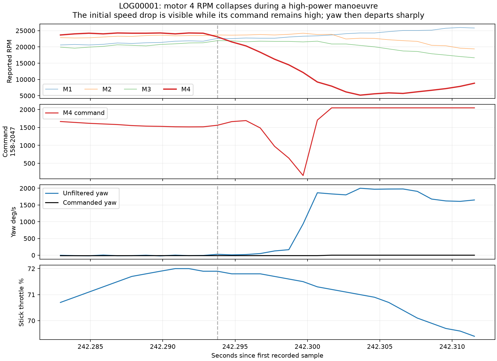

# Crash analysis — LOG00001, 13 September 2026

**The crash is in LOG00001, beginning around 4:02.29, with a large impact at 4:03.23.** The pilot subsequently confirmed remembering hitting something at the start. Taken together, the recollection and data favour a collision-induced motor/prop disturbance and tumble. They do not establish a spontaneous ESC failure or a PID-induced crash.

This flight used **default Damping 1.00**, with roll/pitch upper D 40/46 and D minima 30/34. Dynamic Idle was disabled. The later Damping 1.10 experiment was not active during this crash.

## Sequence

Times are elapsed from the first main sample in LOG00001. Millisecond timestamps identify samples, not the exact physical timing of contact: gyro filtering, RPM reporting and sensor update rates differ.

| Time | Recorded observation | Interpretation |
| --- | --- | --- |
| 4:02.20–4:02.29 | Throttle rises from about 16% to 72%. All four RPM channels rise. A pitch manoeuvre is commanded; the gyro initially follows it. Nearby GPS samples indicate roughly 30 km/h ground speed. | The quad is powering through a manoeuvre before the upset. This is not a zero-throttle idle event. GPS cannot give exact impact speed or identify the obstacle. |
| 4:02.293–4:02.304 | Logical motor 4 RPM falls from about 24,200 to 5,200 RPM in roughly 11 ms. Its command initially remains high and even rises briefly as RPM starts falling. | A sudden motor/prop loading or drive disturbance is visible. With the pilot's recollection, contact with an obstacle is the leading explanation. RPM alone cannot prove that a particular prop was the contact point. |
| About 4:02.30–4:02.40 | Yaw departs abruptly from the small command, followed by a large pitch/roll tumble. Gyro readings approach or reach 2000 deg/s. Motor commands hit their upper and lower limits. | The tumble is not requested by the sticks. The controller is applying strong corrections but cannot maintain the requested motion during the disturbance. Gyro clipping prevents reconstructing the full rotation accurately. |
| About 4:02.50 | Throttle falls to nearly zero. By this time the measured rotation rates briefly follow the commands more closely again. | The pilot reduces power after the initial disturbance. Closer rate tracking does not establish that the quad is upright or has recovered a safe trajectory. |
| 4:03.230 | Accelerometer magnitude peaks at about 18.7 g with another abrupt rotation disturbance. | A substantial later impact is recorded, consistent with the subsequent crash contact. The log cannot identify the surface; calling it the ground specifically would be an inference. |
| 4:03.315 | DISARM event, reason 4 (SWITCH), then clean log end. | Final disarm is about 85 ms after the large impact and about one second after the initial disturbance. It did not initiate this crash. |

The first ARM mode-request transition away from ARM is at 4:03.262, also after the large impact. The mode-request flag briefly returns before final disarm. Receiver signal and channel-valid flags remain true, with failsafe phase idle. This identifies the recorded switch-disarm path, not the physical switch action or pilot intent.

## The key motor observation

The following are direct sample values, not inferred motor commands:

| Elapsed seconds | Motor 4 RPM | Motor 4 command, raw | Stick throttle | Unfiltered yaw |
| --- | ---: | ---: | ---: | ---: |
| 242.292793 | 24,214 | 1518 | 71.9% | -8 deg/s |
| 242.293779 | 23,100 | 1562 | 71.9% | 27 deg/s |
| 242.294766 | 21,543 | 1663 | 71.8% | 10 deg/s |
| 242.295752 | 20,314 | 1692 | 71.8% | 20 deg/s |
| 242.299699 | 12,143 | 158 | 71.5% | 934 deg/s |
| 242.301672 | 7,943 | 2047 | 71.2% | 1830 deg/s |
| 242.303645 | 5,171 | 2047 | 71.0% | 2000 deg/s |

The initial RPM collapse is not explained by an initial commanded shutdown of that motor. Later commands swing drastically as the controller responds to the changing gyro measurements. A prop strike could produce this pattern. An electrical drive disturbance could also resemble it in isolation, so the pilot's report materially improves the interpretation. There is no direct ESC desync-status channel in this recording to settle that alternative from telemetry alone.

“Motor 4” means `motor[3]` and `eRPM[3]` in the log. Its physical corner has not been established; do not assume a corner from this report, particularly given the board's motor-output reordering. Mechanical RPM is calculated from the recorded electrical RPM and the configured 14 motor poles.

## Battery, controller and tuning relevance

Battery voltage sags during the power increase, including a recorded 19.37 V before the sharp tumble and 18.38 V during it. These are relatively slow battery-sensor samples, not measurements of the ESC phase voltages. They do not prove a battery-caused failure. The flight-controller log remains continuous through the event with no decoded corruption or reset, and the initial RPM collapse is concentrated in one channel.

The controller reaches output limits during the tumble. This is evidence of the severity of the disturbance, not evidence that the default gains were wrong. The gyro was tracking the requested motion before the sudden disturbance. The recorded sequence and the pilot's remembered contact give no basis for tuning PIDs specifically to prevent this crash.

Dynamic Idle is not an established remedy for this event. Throttle is about 72% and motor speeds are around 20,000–24,000 RPM immediately before the initial disturbance, well above the proposed 3,500 RPM floor. It cannot prevent an obstacle collision. The proposed Dynamic Idle comparison remains a separate investigation of ordinary low-throttle recovery shaking.

Check the props, motor bells/shafts, arms and mounting for damage from this contact before interpreting subsequent tuning differences. If a similar sudden tumble ever occurs with no contact, the motor-speed evidence would justify a separate motor/ESC investigation; this event alone does not justify replacing a motor or changing ESC settings.

## Other recordings and limitations

The five substantial flight segments were scanned for major gyro-versus-command departures and their endings reviewed. The other large tracking-error candidates occur during rapid commanded flips/rolls and do not provide the same clear collision/tumble/impact sequence as LOG00001. This does not rule out lighter contacts or crashes after disarm. Normal Blackbox recording ends at disarm, so it may omit a subsequent ground impact entirely.

All seven files end with reason 4 (SWITCH). No receiver-loss or failsafe transition is logged. No claim is made that every disarm was intentional or that all reported crashes can be reconstructed from these files.

No video, obstacle geometry or reliable height-above-ground measurement was available. The accelerometer magnitude is an approximate onboard measurement, not a structural load calculation. Exact attitude during the clipped gyro interval cannot be recovered reliably by integrating this log.

## Evidence and reproduction

- [Full crash plot](LOG00001_overview.png)
- [Initial disturbance, expanded](LOG00001_onset.png)
- [Large impact and disarm](LOG00001_impact.png)
- [Full-resolution crash samples](LOG00001_crash_samples.csv)
- [Threshold timestamps](onset_thresholds.json), [selected snapshots](snapshots.json), [all major tracking-error candidates](major_events.json)
- Analysis script: `../crash.py`; run `python analysis/2026-09-13/crash.py` from the workspace root.
- [Betaflight RPM telemetry documentation](https://betaflight.com/docs/wiki/guides/current/DSHOT-RPM-Filtering): RPM originates at the ESC and is converted using motor pole count; RPM alone is distinct from explicit ESC fault telemetry.
- [Betaflight 4.5.1 switch-disarm implementation](https://github.com/betaflight/betaflight/blob/4.5.1/src/main/fc/rc_controls.c) and [official Explorer reason mapping](https://github.com/betaflight/blackbox-log-viewer/blob/master/src/flightlog_fielddefs.js).

No flight-controller or ESC configuration was changed.
