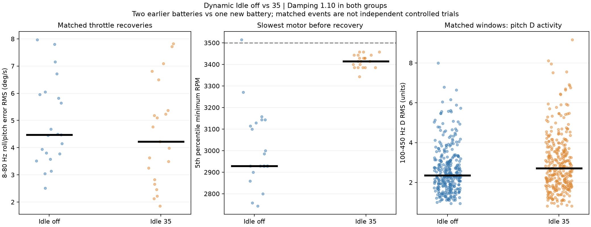

# 15 September 2026: Dynamic Idle, first battery

Dynamic Idle 35 is visibly regulating low-throttle motor RPM. Compared with the two September 13 batteries at the same Damping 1.10, the first new battery has far fewer dips below 3,000 RPM. Throttle-recovery shaking is lower in most matched event pairs, but the aggregate improvement is small and sensitive to event selection. This supports retaining 35 as the next baseline; it does not establish that propwash is eliminated or the tune is finished.

The pilot reports a substantial improvement in feel. They did not specifically check motor temperature, but did not notice hot motors. No motor-temperature field was recorded, and unchanged prop condition between dates has not been confirmed.

## Flight and settings

Primary flight: `15_9_2026_bfl/LOG00008.BFL`, 4:30.807 from first to last recorded sample, 274,485 main samples, zero invalid decoder callbacks. Sample interval is approximately 987 microseconds (about 1,013 Hz), maximum 1,051 microseconds. The log ends cleanly.

Comparison flights: September 13 `LOG00006` and `LOG00007`. All three use Betaflight 4.5.1 on SPEEDYBEEF405V4, Damping 1.10, roll P/I/D 45/80/44, pitch 47/84/50, and D minimum 33/37. Raw header comparison against LOG00007 shows only these differences:

| Header | Earlier | First new battery |
|---|---:|---:|
| `dyn_idle_min_rpm` | 0 | 35 |
| `motorOutput` | 158,2047 | 48,2047 |
| Start datetime and battery reference | Different flight | Different flight |

Other recorded tuning headers are identical. The output endpoint change is consistent with Dynamic Idle removing the old fixed drive floor; it is not evidence of a separate PID change. The lower endpoint is not the continuously adjusted idle command.

GPS Rescue is active from **3:08.902 to 3:28.582** in LOG00008. This interval plus two-second margins is excluded. First/last five seconds and samples within one second of acceleration above 10 g are also excluded. About 237 seconds of the new flight remain eligible before applying manoeuvre-specific criteria. Receiver status remains valid with no recorded failsafe in this flight.

## Direct evidence of RPM regulation

During manual flight above 10 km/h with stick throttle below 1%, the following describes the slowest of the four motors at each sample:

| Measure | Sept 13 LOG00006 | Sept 13 LOG00007 | Sept 15 LOG00008 |
|---|---:|---:|---:|
| Selected low-throttle time | 18.95 s | 20.59 s | 17.49 s |
| Median slowest-motor RPM | 3,371 | 3,157 | **3,514** |
| 5th percentile slowest-motor RPM | 2,843 | 2,900 | **3,386** |
| Samples with any motor below 3,000 RPM | 10.96% | 16.99% | **0.011%** |
| Lowest recorded RPM in this selection | 2,557 | 2,400 | 2,929 |

The improvement also holds for the broader below-10%-throttle selection: below-3,000 RPM samples fall from 10.35% and 15.43% to 0.009%. These are fractions of sampled time, not percentages of motors stalling. RPM is derived from recorded eRPM using 14 motor poles; repeated telemetry samples are not independent measurements.

The slowest motor clusters around the requested 3,500 RPM. Brief undershoots remain, so the target should not be interpreted as an absolute hard floor. In 23.6% of selected near-zero-throttle samples, at least one motor receives a command below the former fixed minimum of 158.

Betaflight uses RPM feedback to adjust minimum motor drive and allows stronger braking when RPM permits. These mechanisms make improved low-throttle handling plausible, even when a broad shaking score changes little. This analysis directly establishes the RPM behaviour and command freedom; it does not separately measure braking torque or prove faster manoeuvre settling. See the [official Dynamic Idle explanation](https://betaflight.com/docs/wiki/guides/current/Dynamic-Idle) and [Betaflight 4.5.1 mixer implementation](https://raw.githubusercontent.com/betaflight/betaflight/4.5.1/src/main/flight/mixer.c).

## Shaking when power returns

There are 56 eligible earlier recoveries and 25 new recoveries. Matching without replacement on throttle, speed, stick-command magnitude, battery voltage, and preceding speed/command magnitude produces **21 pairs**.

The shaking measure is roll/pitch gyro-minus-setpoint RMS in the 8–80 Hz band, measured 0.05–1.05 seconds after throttle crosses 20% following a low-throttle interval. It measures angular-rate disturbance, not camera vibration or angular displacement, and can still contain ordinary tracking error.

| Matched recovery measure | Idle off | Idle 35 |
|---|---:|---:|
| Median shaking RMS | 4.48 deg/s | 4.23 deg/s |
| Mean shaking RMS | 4.89 deg/s | 4.49 deg/s |
| Median peak 150 ms error envelope | 10.33 deg/s | 9.71 deg/s |
| Median preceding low-RPM 5th percentile | 2,929 RPM | 3,414 RPM |

Shaking RMS is lower in **16/21 pairs**, and peak shaking is lower in **15/21**. The reduction in the group median RMS is about **6%**, with wide overlap between groups. Time above the chosen 8 deg/s disturbance threshold does not decrease: its median is about 0.14 seconds in both groups.

This modest improvement is not robust enough to claim a precise tuning benefit. A stricter matching tolerance leaves nine pairs and reverses the group-median result (3.94 to 5.10 deg/s), despite five of nine individual pairs being lower. Lower-command and zero-throttle subsets retain a small median improvement. Alternate frequency bands also give different effect sizes. These are repeated events from two older batteries and one new battery on different days, not independent controlled trials; wind, trajectory, prop condition, and airflow are incompletely matched.

Across 317 matched general-flight half-second windows, median shaking is slightly higher (1.33 to 1.64 deg/s). Median high-frequency pitch D activity is about 15% higher (2.35 to 2.71 units), while roll D activity is about 5% higher. Neither metric measures motor temperature. The evidence therefore supports better idle RPM regulation and a possible modest recovery benefit, rather than universally smoother flight or reduced motor heating.



## Moments to review

Times are relative to the first recorded sample, not flight-controller uptime or an independently synchronized video clock.

- **1:25.81–1:26.5, LOG00008:** power returns after a coast, with visible but settling roll/pitch disturbance. This is the closest match by flight conditions: its recovery RMS is 5.23 deg/s versus 6.71 in the earlier LOG00007 recovery at 0:44.88. The earlier plot also contains a later commanded flip outside the scored recovery interval; that flip is not counted as propwash. [New event](results/matched_1_on.png), [earlier event](results/matched_1_off.png).
- **2:53.49, LOG00008:** a remaining roll/pitch shake after a full-power burst, throttle cut and reapplication. The error envelope falls quickly after approximately 2:53.6. A motor holds close to 3,500 RPM during the coast, yet the later disturbance still occurs: idle regulation does not remove every source of shaking. [Event plot](results/LOG00008_shake_173.49.png).

Other saved residual-shake candidates are at 0:57.46 and 1:39.43. They are descriptive examples, not the basis for selecting comparison events. [First-battery overview](results/first_battery_overview.png).

## Next baseline and remaining scope

Retain **Dynamic Idle 35 and Damping 1.10** for the next comparison, rather than changing another parameter based on this one battery. This preserves the combination that felt better and has demonstrated tighter idle RPM control. Check prop condition after the reported crash and specifically check motor temperatures after the next short flight before considering more D gain. The current evidence does not justify increasing the idle target or damping further.

The second-battery crash is deliberately not diagnosed here. File inventory found LOG00009 has 22 invalid decoder callbacks, a roughly 0.719-second sample gap, and no clean log-end event. LOG00010 is a 2.24-second essentially stationary arm/disarm; LOG00011 contains 4:15.08 of data. LOG00013 and LOG00014 are empty. These facts limit later reconstruction but do not establish why recording was interrupted or what caused the crash. None of these later files contributes to this tuning comparison.

## Reproduction and artifacts

From the repository root, using the existing workspace decoder and Python dependencies:

```text
node analysis/decode.mjs 13_9_2026_bfl analysis/2026-09-13/decoded
node analysis/decode.mjs 15_9_2026_bfl analysis/2026-09-15/decoded
python analysis/2026-09-13/inventory.py analysis/2026-09-15
python analysis/2026-09-15/dynamic_idle.py
```

The decoder now explicitly skips and inventories zero-byte inputs. The shared comparison loader accepts a dated input folder and reads motor endpoints from each header. Original September 13 motor endpoints remain 158/2047, preserving its earlier endpoint calculation.

Method details, filtering, eligibility and matching tolerances are in [dynamic_idle.py](dynamic_idle.py). Numerical outputs: [comparison.json](results/comparison.json), [matched recovery pairs](results/matched_recoveries.json), [all recovery candidates](results/recoveries.csv), [general-flight windows](results/windows.csv), [inventory](inventory.json), and [decode summary](decoded/decode-summary.json). The new dataset was decoded and the full analysis executed successfully; plotted examples were visually reviewed.
