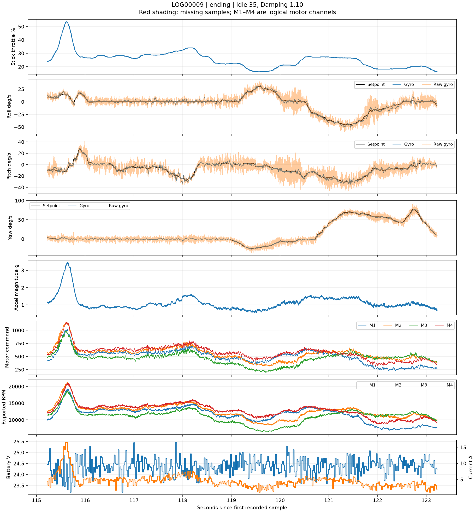
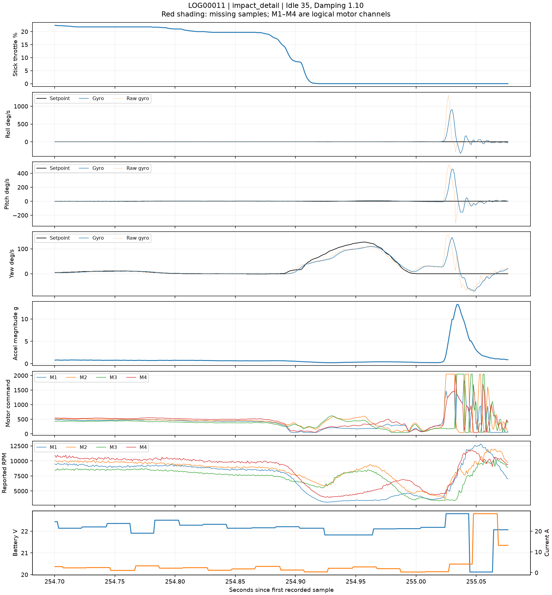

# Second-battery crash investigation, 15 September 2026

**The reported second-battery crash is likely absent from the saved ending of LOG00009.** The pilot has confirmed flying again after retrieving the quad, supporting the interpretation of LOG00011 as the subsequent flight. LOG00009 is the first recording after the first battery, but its saved data stops abruptly at 2:03.222 while the quad is controlled. LOG00011 records a sharp contact at 4:15.024 followed by switch disarm; its approach is consistent with a final landing. The pilot has not separately confirmed that landing or the crash's exact elapsed time, so the association remains an inference rather than a positively identified crash timestamp.

There is no basis here to attribute the reported crash to Dynamic Idle or the PID tune. Equally, missing crash data cannot rule out an unrecorded hardware or control problem.

**Pilot clarification:** the crash disconnected the battery, and the pilot subsequently retrieved the quad and flew again. This provides a likely explanation for the incomplete recording: abrupt power loss prevented recording and file finalization from finishing. The reported order is crash, then battery disconnection; the saved log does not independently capture that sequence.

The pilot later reported installing older damaged props for that subsequent flight and hearing unusual sounds. They clarified on September 16 that the rear-right **prop nut** was loose and not clamping the prop tightly, rather than loose motor mounting screws. A [separate post-crash vibration comparison](../post_crash/REPORT.md) addresses that finding and the recorded motor-correction bursts. Its timing does not establish that the loose assembly caused the earlier crash.

## Recording sequence

| File | Header start time (as recorded) | Recorded duration | Finding |
|---|---|---:|---|
| LOG00008 | 14:30:23.648 | 4:30.807 | Previously analyzed first battery |
| LOG00009 | 14:38:40.057 | 2:03.222 | Starts with fresh-pack voltage; abrupt file ending, no recorded disarm |
| LOG00010 | 14:51:39.612 | 0:02.244 | Essentially stationary arm/disarm |
| LOG00011 | 14:52:17.519 | 4:15.076 | Flight ending in low-ground-speed contact and switch disarm |
| LOG00013/14 | No header | No data | Zero-byte files |

All timestamps are from the headers; their correspondence to local civil time has not been verified. LOG00010 starts at controller uptime 52.094 seconds, lower than LOG00009's final 175.444 seconds, showing a controller restart between them. LOG00011 starts at uptime 90.002 seconds, consistent with the same boot as LOG00010. A restart alone does not tell us why power was interrupted or whether the same physical battery was reused.

## LOG00009: the saved flight ends before any identifiable terminal crash

The file contains exactly **4,194,304 bytes (4 MiB)**, one Blackbox header, and no end-of-log marker or DISARM event. It has 22 invalid decoder callbacks. The only main-sample gap longer than 5 milliseconds runs from **0:22.829312 to 0:23.548106**, a **0.718794-second** gap. A commanded rapid pitch manoeuvre precedes it; controlled flight is recorded after it. No trajectory or cause is inferred inside the gap.

The last five seconds show:

- Maximum absolute gyro-versus-setpoint error of only **9 deg/s**, across all axes.
- Maximum measured acceleration magnitude **1.56 g**.
- All motors above **6,343 RPM** throughout that interval.
- Minimum recorded pack voltage **23.57 V**; no recorded terminal voltage collapse.

At the final sample, **2:03.222**, throttle is 16.2%, gyro roll/pitch/yaw is -5/-1/8 deg/s against commanded -7/1/9 deg/s, and motor speeds are approximately 7,629/9,757/10,043/9,114 RPM. The most recent GPS ground-speed sample is 16.02 km/h, 67 milliseconds old. This is the speed at the saved file's end, **not an identified impact speed**.

Receiver-status records remain valid with failsafe phase zero. GPS Rescue is active at 0:33.697–0:44.217 and ends normally in the saved data; it is not active at the final sample. The larger early tracking errors at approximately 0:11.20 and 0:14.57 occur during commanded fast manoeuvres, followed by continued controlled flight. The 7.65 g peak at 0:10.808 occurs under full throttle and is not sufficient evidence of a collision.

The file is incomplete as a flight record. With the pilot's confirmation of battery disconnection during the crash, abrupt power loss is a likely explanation for the missing ending. Betaflight's SD-card writes are asynchronous: queued data may not yet be physically written, as documented in the [4.5.1 Blackbox I/O implementation](https://raw.githubusercontent.com/betaflight/betaflight/4.5.1/src/main/blackbox/blackbox_io.c). Consequently, the last readable sample need not coincide with either impact or power loss. The amount of missing time cannot be established from this file, and the exact 4 MiB length does not by itself establish the specific filesystem failure mechanism. The earlier 0:22.829 recording gap remains separately unexplained. There is no hidden second Blackbox header in the supplied file. If the remembered crash occurred after 2:03, its onset and aftermath are absent from this copy.



[Recording-gap plot](LOG00009_recording_gap.png). Red shading is missing data, not a reconstructed motion trace.

## LOG00011: recorded contact at 4:15

This file decodes without invalid callbacks or gaps above 5 milliseconds and has a clean ending. Its final eight seconds show low ground speed and controlled stick tracking, followed by a throttle cut and a brief external-disturbance signature.

| Elapsed time | Recorded sequence |
|---|---|
| 4:14.912 | Throttle falls below 1%; roll/pitch remain near the commanded rates. The latest GPS ground speed is 3.31 km/h. |
| About 4:15.024 | Abrupt uncommanded roll/pitch rotation appears in the raw gyro. Acceleration and corrective motor commands rise sharply. |
| 4:15.030 | Filtered roll peaks at about 909 deg/s during the contact response. |
| 4:15.035 | Measured acceleration magnitude peaks at 13.27 g. |
| 4:15.050 | Logged ARM switch/mode flag clears. |
| 4:15.076 | DISARM reason 4 and clean log end, approximately 52 milliseconds after disturbance onset. |

Reason 4 is `DISARM_REASON_SWITCH` in [Betaflight 4.5.1's source](https://raw.githubusercontent.com/betaflight/betaflight/4.5.1/src/main/fc/core.h). The ARM mode flag and the actual disarm event are kept distinct here. Receiver status is valid and no failsafe is recorded at the ending.

The latest GPS sample before contact is **2.92 km/h**, about 35 milliseconds old, with 22 satellites. This is horizontal ground speed; it does not provide vertical descent speed or total impact speed. GPS at such low speeds also has finite measurement uncertainty.

Before the sudden disturbance, all four RPM channels remain nonzero; the minimum in the preceding 0.323 seconds is approximately 3,129 RPM. There is no isolated motor stopping first, sustained uncommanded tumble, or preceding runaway oscillation visible in this approach. Motor-command saturation starts with the contact response, not a sustained period beforehand. Rapid command changes after contact should not be diagnosed as the original cause of the impact.

This is consistent with a firm landing or other low-horizontal-speed contact, followed by switch disarm. The log cannot identify the contacted object, physical motor corner, damage, or pilot intention. It should not be relabeled as the remembered mid-flight crash without confirmation. A brief high-g contact also occurs at the end of the previously analyzed first battery, illustrating why peak acceleration alone cannot distinguish a landing from a crash.



## What would resolve the remaining uncertainty

The pilot confirmed flying again afterward. This supports LOG00011 being the later flight, whose final contact should not be treated as the earlier crash. An original SD-card copy of LOG00009 that is larger than 4 MiB, any additional log from that interval, or synchronized flight video could provide the missing evidence. The original file was not accessible at the previously used path `D:\LOGS\LOG00009.BFL` when checked after that clarification; this does not establish whether it exists elsewhere on the card. The workspace copy remains exactly 4,194,304 bytes. This analysis does not recover deleted or unallocated SD-card data.

No PID or Dynamic Idle change is recommended on the basis of these crash records alone.

## Reproduce

After decoding the September 15 folder as described in the parent report:

```text
python analysis/2026-09-15/crash.py
```

The analysis reads recorded signals directly and does not run continuous filters or interpolate motor/gyro traces across missing frames. GPS values in snapshots use the latest preceding record, with its age reported. M1–M4 refer to logical Blackbox motor channels, not verified physical corners. Candidate scans include commanded manoeuvres and are not automatically classified as crashes.

Artifacts: [scan and snapshots](scan.json), [contact thresholds](impact_thresholds.json), [contact samples](LOG00011_impact_samples.csv), [LOG00009 overview](LOG00009_overview.png), and [LOG00011 ending](LOG00011_ending.png). The decoder's [integrity inventory](../decoded/decode-summary.json) is shared with the tuning analysis. Scripts were executed on the supplied files and the ending/contact plots visually reviewed.
