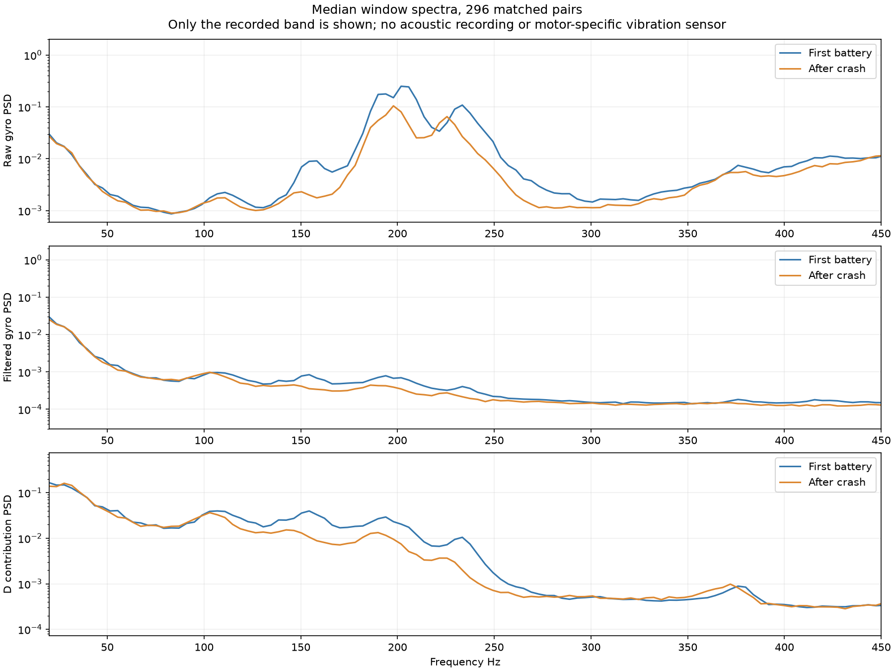

# Post-crash props and reported loose rear-right motor

The pilot reports fitting older worn/damaged props after the crash and hearing unusual sounds during subsequent flight. On September 16 they clarified that the **rear-right prop nut**, not the motor mounting screws, was loose: it was not clamping the prop tightly and was easy to unscrew. They describe the sound as a high-pitched vibration and suspect rapid motor corrections.

**LOG00011 contains brief vibration and motor-correction bursts, but it does not independently confirm prop slip or identify the sound's cause.** In comparable flight conditions, its recorded high-frequency gyro vibration is lower than the first battery's. This is a measurement at the flight controller, not a finding that the damaged props or loose assembly were mechanically acceptable. The pilot's physical inspection establishes the reported loose nut independently of these log metrics.

## Comparison with the first battery

Compared LOG00008 (first battery) with LOG00011 (flight after retrieval), both decoding without errors. All raw configuration headers match except flight datetime and initial battery reference. Both use Dynamic Idle 35 and Damping 1.10.

Excluded the first/last five seconds, high-acceleration contacts and surrounding samples, and GPS Rescue plus transition margins. Selected nonoverlapping half-second manual-flight windows with throttle 10–65%, GPS ground speed above 10 km/h, limited angular-rate commands, and little rapid stick activity. Matched without replacement using throttle, ground speed, command magnitude, voltage, throttle variation, and mean motor RPM, producing **296 pairs**.

| Median measure | First battery | After crash | Difference |
|---|---:|---:|---:|
| Raw gyro 100–450 Hz RMS, combined axes | 6.74 deg/s | 3.91 deg/s | 42% lower |
| Filtered gyro 100–450 Hz RMS, combined axes | 0.395 deg/s | 0.315 deg/s | 20% lower |
| D contribution 100–450 Hz RMS, roll/pitch | 2.21 units | 1.45 units | 35% lower |
| Roll/pitch 8–80 Hz tracking-error RMS | 1.59 deg/s | 1.27 deg/s | 20% lower |

Raw high-frequency gyro vibration is higher after the crash in only 10 of the 296 pairs. Its 90th percentile is also lower, 8.42 versus 5.09 deg/s. Stricter matching leaves 220 pairs and looser matching 334; both retain the lower post-crash raw-vibration result. The spectra show less power in the broad roughly 150–250 Hz region after the crash, rather than a new strong peak there. Mean matched motor RPM is similar between flights (median approximately 12,715 versus 12,677 RPM).

These repeated segments from two flights are not independent controlled hardware tests. Props, mechanical condition, manoeuvres, and battery history differ; the lower numbers do not establish which change caused the difference or justify using damaged props.



## Recorded moments to review

There are local bursts above the later flight's own background level. These are examples of recorded vibration, not confirmed timestamps of the reported sound:

| LOG00011 elapsed interval | Raw gyro 100–450 Hz RMS | Context |
|---|---:|---|
| **1:13.5–1:14.0** | 7.41 deg/s | About 30% throttle, turning; filtered high-frequency RMS 0.56 deg/s |
| **2:14.5–2:15.0** | 7.20 deg/s | About 13% throttle; filtered high-frequency RMS 0.29 deg/s |
| **2:23.5–2:24.0** | 7.38 deg/s | About 25% throttle, turning; filtered high-frequency RMS 0.30 deg/s |

Plots: [1:13.75](LOG00011_noise_73.75s.png), [2:14.75](LOG00011_noise_134.75s.png), [2:23.75](LOG00011_noise_143.75s.png). These are among the noisier selected windows in LOG00011, but none establishes a unique mechanical fault. The [whole-flight vibration timeline](vibration_timeline.png) includes faster manoeuvres outside the matched-window selection; the two flights share an elapsed-time axis only and are not synchronized manoeuvre by manoeuvre.

There are no zero-RPM samples in the usable flight portions of either recording. LOG00011's minimum there is about 2,786 RPM, versus 2,743 in LOG00008. Nonzero RPM is not proof of adequate thrust or a secure prop; it is only reported motor rotation. The previously reviewed LOG00011 ending shows contact followed by switch disarm, without a preceding motor stoppage.

## What this can and cannot confirm

### Follow-up: short motor corrections and the loose prop nut

The follow-up examines 100–450 Hz variations in differential motor commands (each motor command minus the four-motor mean), using a 100 ms RMS envelope throughout usable manual flight. This includes power transitions and fast manoeuvres omitted from the earlier steady-flight matching. A separate shortlist limits nearby stick-command magnitude to avoid labeling commanded flips as unexplained oscillation.

Clear examples in LOG00011 are:

- **1:55.2–1:55.8:** rapid motor-command and D-term changes while power is reapplied/varied after a turn. At 1:55.283, roll/pitch/yaw setpoints are approximately -1/1/0 deg/s, throttle is 39.7%, and the short-window high-frequency differential-command RMS is 25.8 command units. There is genuine control activity, but no direct measurement of slipping. [Full event](LOG00011_corrections_115.28s.png), [200 ms detail](correction_detail.png).
- **2:24.3–2:24.6:** a shorter correction burst during a throttle punch and cut. The selected peak at 2:24.378 has 23.1 command units RMS, with recorded high-frequency command content around 194 Hz. This is a frequency in the sampled motor-command signal, **not an identified acoustic pitch**. [Event](LOG00011_corrections_144.38s.png).

Similar or stronger correction bursts occur in the first battery. Across usable manual flight, the 99th-percentile command envelope is 28.3 units before the crash versus 20.7 afterward; maxima are 42.7 versus 33.0 units. These whole-flight figures are descriptive and not matched manoeuvre comparisons. They do not establish a new runaway control oscillation after the crash. The largest post-crash all-manoeuvre peaks occur around commanded fast rolls and their stops, which cannot be interpreted as prop slip solely from their size.

The earlier observation that RPM did not stop does **not** rule out a slipping prop. DShot reports motor electrical rotation, converted to motor RPM; it does not independently sense the propeller's rotation. A prop that is not clamped can potentially move relative to the motor while RPM telemetry continues. That makes the pilot's proposed mechanism plausible, not proven by the log. See the [official explanation of motor RPM telemetry](https://betaflight.com/docs/wiki/guides/current/DSHOT-RPM-Filtering).

Audio/video synchronized with these intervals, or disappearance of the sound after replacing the damaged props and securing the nut, would help associate the recorded corrections with the observed sound. The analysis does not justify deliberately flying with the prop loose to reproduce it.

Damaged/unbalanced props and loose motor hardware are plausible sources of vibration or unusual sounds; Betaflight discusses these mechanical sources in its [gyro-noise explanation](https://betaflight.com/docs/wiki/guides/archive/Gyro-And-Dterm-Filtering-Recommendations-3-1). That archived page is used for the mechanical principle, not for firmware-specific filter settings.

The Blackbox log records no audio and no separate vibration sensor at each motor. At approximately 1,013 logged samples per second, frequencies above roughly 506 Hz cannot be resolved unambiguously. The analysis uses 100–450 Hz to stay below that limit; it is not a measurement of the full audible spectrum. Noise heard at a motor need not produce a larger measured vibration at the flight-controller gyro.

The physical rear-right corner has not been verified against the logical Blackbox M1–M4 channels for this build. No individual motor is labeled faulty from differences in RPM or command alone. The later inspection also does not establish exactly when the fastener became loose, or whether it was already loose before the earlier crash.

## Follow-up: other changes in motor spinning

A separate RPM-response screen compared LOG00008, the saved pre-crash portion of LOG00009, and post-crash LOG00011. It excluded takeoff/landing, contacts, GPS Rescue, and 200 ms around LOG00009's recording gap. The usable intervals contain no zero-RPM samples or samples below 2,500 RPM. The lowest motor RPM is 2,743 before the crash in LOG00008 and 2,786 afterward in LOG00011. Maximum recorded post-crash RPM is about 31,857, within the pre-crash observed range reaching 33,229; this is descriptive, not a motor speed limit or a matched full-power test.

The screen looked for greater than 40% RPM falls or rises over approximately 20 ms from speeds above 8,000 RPM while motor command remained above 300 and stable within 20% over the preceding 80 ms. **No events met these steady-command criteria in any of the three files.** This is a defined anomaly screen, not an exhaustive desync test or a guarantee against intermittent prop slip.

There are sharp RPM reductions during commanded manoeuvres. For example, logical M2 falls from about 12,986 to 6,514 RPM around **2:08.61** in LOG00011, and from about 16,057 to 8,086 around **3:25.84**. In both cases, its command had already been driven down to the minimum during braking. RPM falls after the command reduction, then settles; these are not isolated speed collapses while the controller continuously requests high drive. Similar sequences are present before the crash. [2:08.61 example](LOG00011_rpm_drop_M2_128.61s.png), [3:25.84 example](LOG00011_rpm_drop_M2_205.84s.png).

**A relative motor-speed/command balance change does stand out against the first battery.** Matching 45 low-command, steady-throttle half-second intervals on throttle, voltage, ground speed, and signed roll/pitch/yaw commands gives the following median motor RPM relative to the simultaneous four-motor mean:

| Logical channel | First battery LOG00008 | Post-crash LOG00011 |
|---|---:|---:|
| M1 | 94.0% | 103.0% |
| M2 | 104.6% | 100.3% |
| M3 | 96.8% | 88.2% |
| M4 | 104.6% | 108.4% |

Commands shift in the same direction: M1's relative command rises from 93.2% to 103.3%, while M3's falls from 96.0% to 86.5%. M3 is therefore being asked to run more slowly; the lower RPM alone is not evidence that it cannot follow its command. These percentages are relative motor shares, not throttle percentages or measured thrust.

Crucially, a nine-pair comparison against the **same day's saved pre-crash LOG00009** already shows M3 running low: 90.5% of the four-motor mean before versus 89.5% afterward. That smaller comparison is limited by the shortened recording and differing battery state, but prevents labeling the first-battery difference as clearly crash-caused. Props, battery placement/weight balance, and flight conditions could affect the distribution; these causes were not individually measured. No physical corner is inferred from the logical motor labels.

The evidence supports a modest redistribution of commanded motor speed versus the first battery, plus the previously documented correction bursts. It does **not** identify a new motor stopping, uncontrolled overspeed, or a specific crash-damaged motor in the recorded flight. This conclusion does not establish whether the loose prop slipped.

Method and numerical outputs: [RPM-response script](../motor_response.py), [screen results](motor_response.json), and [matched motor balance](matched_motor_balance.json). The script ran successfully; the largest post-crash drop example was visually inspected against the preceding command history.

## Next action

Replace the damaged props and properly secure the rear-right prop nut before another flight; replace a nut that no longer locks securely. Inspect the prop seating and motor shaft/threads with power disconnected, as well as other crash damage. Keep Dynamic Idle 35, Damping 1.10, and filters unchanged for the next short flight after repair, then compare its log and sound. Repairing a known mechanical issue takes priority over tuning around it.

This post-crash flight should remain excluded from the primary Dynamic Idle tuning comparison because its hardware condition changed.

## Reproduction

```text
python analysis/2026-09-15/post_crash.py
python analysis/2026-09-15/motor_bursts.py
python analysis/2026-09-15/motor_response.py
```

The script reuses the earlier documented filtering, scaling, and mode exclusions. PSDs use Welch estimates within individual selected windows, then their median, avoiding joins between unrelated segments. The analysis ran successfully and its spectral, timeline, and event plots were visually inspected.

Artifacts: [numerical results](comparison.json), [matched first-battery windows](matched_before.csv), [matched post-crash windows](matched_after.csv), and [analysis script](../post_crash.py).

Follow-up artifacts: [motor correction burst measurements](motor_bursts.json) and [burst analysis script](../motor_bursts.py). Both scripts ran successfully, and the new correction-event plots were visually inspected.
