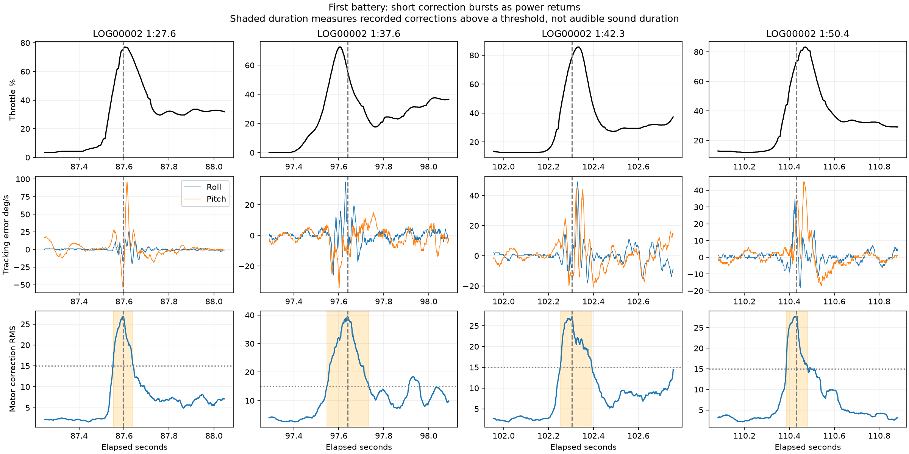

# First battery: roll/coast/recovery and brief motor-correction bursts

The pilot describes a quick Split-S, recovery toward horizontal, then adding throttle and hearing a wheeze lasting less than 500 ms. The search is confined to September 20's first main flight, **LOG00002**. Battery calibration is deferred.

**The log contains repeated manoeuvre/recovery sequences with brief correction bursts as power returns. The most useful sound-recollection candidates are 1:27.6 and 1:37.6, with further examples at 1:42.3 and 1:50.4.** These are exact recorded signal times, not confirmed acoustic timestamps.

## Review shortlist

All times are elapsed from the first decoded main sample of LOG00002, not wall-clock time. The first sample is about 0.159 s after the log's sync event; an OSD timer may also include the preceding short arm, so allow a small timer offset.

| Watch this manoeuvre interval | Burst peak | Measured strong-correction interval | Duration at reference threshold | Throttle punch peak |
|---|---|---|---:|---:|
| **1:26-1:28** | **1:27.596** | 1:27.552-1:27.640 | **89 ms** | 77% |
| **1:36-1:38** | **1:37.639** | 1:37.547-1:37.733 | **186 ms** | 73% |
| **1:40-1:43** | **1:42.305** | 1:42.253-1:42.393 | **139 ms** | 86% |
| **1:48-1:51** | **1:50.432** | 1:50.386-1:50.481 | **96 ms** | 83% |

1:27.6 follows the clearest fast-roll-then-substantial-pitch-recovery sequence in this shortlist. The fast roll is at 1:26.41-1:26.59, followed by a pronounced pitch rotation around 1:26.9-1:27.14, before throttle returns. Roll rate is near zero at the later burst, while commanded pitch rate is still -92 deg/s. Thus this is recovery toward level, not proof that the quad was exactly horizontal.

1:37.6 follows a fast roll at 1:36.45-1:36.65, a zero-throttle coast and a later power punch. Pitch travel is less pronounced than in the 1:27.6 sequence, so it should be called a roll/coast/recovery candidate rather than a verified textbook Split-S. It has a stronger 100-450 Hz motor-correction burst but less low-frequency tracking error: an audible event need not coincide with the biggest visible wobble.

1:42.3 follows a fast roll at 1:40.50-1:40.67; 1:50.4 follows one at 1:48.88-1:49.07. Both have low throttle, subsequent pitch rotation and a short correction burst at power return. The logs show body rotation and its commanded rate; they do not directly record absolute attitude. Integrals of separate body-axis rates are not Euler angles and cannot independently certify a half-roll/half-loop trajectory or horizontal alignment.

Context plots: [1:27.6](recovery_87.60.png), [1:37.6](recovery_97.64.png), [1:42.3](recovery_102.30.png), [1:50.4](recovery_110.43.png).

## Interpretation and limits

- The deliberate fast rotation and the later power-return correction are distinct events. This analysis targets the later correction.
- The four events occur within roughly 70-130 ms of throttle rising through 20%; measured motor RPM rises with the power demand. At the chosen burst peaks all motors report roughly 20,500-26,000 RPM, with no stopped motor at those instants.
- At 1:27.6, short-window raw angular-rate tracking error reaches about 96 deg/s; at 1:37.6 about 35 deg/s. Both contain short control activity, despite different visible shaking severity.
- The earlier 5:28.6 example remains a strong recovery disturbance (approximately 307 ms above the same reference threshold), but its preceding motion is a different turning/coasting pattern and it is less specific to the newly described Split-S.
- These signatures are compatible with recovery turbulence/propwash and rapid controller corrections. They do not uniquely identify the acoustic cause, prop slip, bearing noise, resonance or an ESC fault. There is no microphone recording in these logs.
- New unscratched props are reported. Prop-nut tightness and exact prop model for today are not confirmed. Do not attribute these bursts to damaged props based on the previous session.

## Method

Loaded the first main flight using the existing parser and calibrated signal definitions. Verified no >5 ms main-frame gaps. Fast rotation groups use roll/pitch gyro magnitude above 200 deg/s with 120 ms pause grouping; angular travel is reported only as body-axis integrated travel.

Recovery triggers cross 20% throttle after at least 80 ms below 5% during the previous two seconds, then reach at least 35% within 600 ms. The correction peak is selected in that recovery window while all axis commands are below 200 deg/s. All 22 detected recovery candidates, including weak and non-Split-S manoeuvres, remain in [candidates.json](candidates.json); the shortlist is descriptive, not a population comparison.

For the burst metric, subtract the four-motor mean command from each motor to remove collective throttle, bandpass 100-450 Hz, combine squared differential signals, then form a 50 ms RMS envelope. Reference duration is the contiguous envelope interval above **15 motor-command units RMS** around its local peak. This threshold is an analysis choice, not a failure limit or an acoustic measurement.

Threshold sensitivity (10 / 15 / 20 units):

| Peak | Durations |
|---|---|
| 1:27.596 | 151 / 89 / 62 ms |
| 1:37.639 | 291 / 186 / 154 ms |
| 1:42.305 | 186 / 139 / 94 ms |
| 1:50.432 | 163 / 96 / 57 ms |

The selected burst cores remain below 500 ms across these thresholds, consistent with the reported brief duration but not proof of matching the sound. Filtering and RMS smoothing affect measured interval boundaries. At approximately 1,013 Hz logging, frequencies above about 506 Hz cannot be resolved; 100-450 Hz here is motor-command modulation, not an identified audible pitch. Barometric traces are context only because airflow affects them.

Reproduce: `python analysis/2026-09-20/split_s.py`. Machine-readable shortlist: [shortlist.json](shortlist.json). No flight settings were changed.
